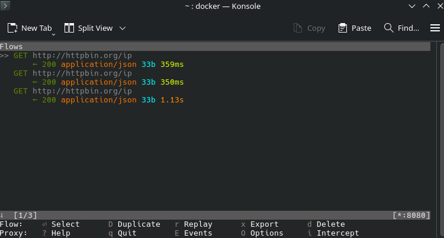

extrablatt_v2
=====================
[](https://crates.io/crates/extrablatt_v2)
[](https://docs.rs/extrablatt_v2)

This is fork of [an original repository](https://github.com/mattsse/extrablatt) "extrablatt" with some updated dependencies.

Customizable article scraping & curation library and CLI.
Also runs in Wasm.

Original project kinda supports WASM:
Basic Wasm example with some CORS limitations: [https://mattsse.github.io/extrablatt/](https://mattsse.github.io/extrablatt/)


Inspired by [newspaper](https://github.com/codelucas/newspaper).

Html Scraping is done via [select.rs](https://github.com/utkarshkukreti/select.rs).

## Features

* News url identification
* Text extraction
* Top image extraction
* All image extraction
* Keyword extraction
* Author extraction
* Publishing date
* References

Customizable for specific news sites/layouts via the `Extractor` trait.

## Diffences from original extrablatt

* Updated dependencies
* More heuristics for article body/authors and etc data extraction
* Reoganized code structure
* More references to [newspaper4k](https://github.com/AndyTheFactory/newspaper4k) ideas
* Configurable threads num
* Proxy support - route requests through HTTP/HTTPS/SOCKS5 proxies if needed
* I am not used to use WASM or CLI in this fork, so those parts are mostly untouched and I can't guarantee they work as expected.

## Documentation

Full Documentation [https://docs.rs/extrablatt_v2](https://docs.rs/extrablatt_v2)

## Example

Extract all Articles from news outlets.

````rust
use extrablatt_v2::Extrablatt;
use futures::StreamExt;

#[tokio::main]
async fn main() -> Result<(), Box<dyn std::error::Error>> {

    let site = Extrablatt::builder("https://some-news.com/")?.build().await?;

    let mut stream = site.into_stream();
    
    while let Some(article) = stream.next().await {
        if let Ok(article) = article {
            println!("article '{:?}'", article.content.title)
        } else {
            println!("{:?}", article);
        }
    }

    Ok(())
}
````

## Proxy Support

Route all HTTP requests through a proxy server:

```rust
use extrablatt_v2::Extrablatt;

#[tokio::main]
async fn main() -> Result<(), Box<dyn std::error::Error>> {
    let site = Extrablatt::builder("https://some-news.com/")?
        .proxy("http://127.0.0.1:8080")  // HTTP proxy
        // .proxy("socks5://127.0.0.1:1080")  // SOCKS5 proxy
        .build()
        .await?;

    // All requests now go through the proxy
    let mut stream = site.into_stream();
    // ...

    Ok(())
}
```

Supported proxy formats:
- `http://host:port` - HTTP proxy
- `https://host:port` - HTTPS proxy
- `socks5://host:port` - SOCKS5 proxy

### Testing Proxy Manually

Use [mitmproxy](https://mitmproxy.org/) via Docker to verify requests go through the proxy:

```bash
# Terminal 1: Start mitmproxy
docker run --rm -it -p 8080:8080 mitmproxy/mitmproxy

# Terminal 2: Run the test example
cargo run --example proxy_manual_test -- http://127.0.0.1:8080
```

You should see the HTTP request appear in mitmproxy's console, proving traffic is routed through the proxy.



```
=== Proxy Test ===
Target URL: http://httpbin.org/ip
Proxy: Some("http://127.0.0.1:8080")
Configuring proxy: http://127.0.0.1:8080
Connecting...
SUCCESS: Connected through proxy!
If using mitmproxy, you should see the request in the proxy console.
```

**Note:** HTTPS requests through mitmproxy will fail with certificate errors (expected behavior - mitmproxy intercepts SSL). For testing, use HTTP URLs or configure your system to trust mitmproxy's CA certificate.

## Command Line

### Install

```bash
cargo install extrablatt_v2 --features="cli"
```

### Usage 

```text
USAGE:
    extrablatt_v2 <SUBCOMMAND>

SUBCOMMANDS:
    article     Extract a set of articles
    category    Extract all articles found on the page
    help        Prints this message or the help of the given subcommand(s)
    site        Extract all articles from a news source.

```

### Extract a set of specific articles and store the result as json

````bash
extrablatt_v2 article "https://www.example.com/article1.html", "https://www.example.com/article2.html" -o "articles.json"
````

## License

Licensed under either of these:

 * Apache License, Version 2.0, ([LICENSE-APACHE](LICENSE-APACHE) or
   https://www.apache.org/licenses/LICENSE-2.0)
 * MIT license ([LICENSE-MIT](LICENSE-MIT) or
   https://opensource.org/licenses/MIT)
   
